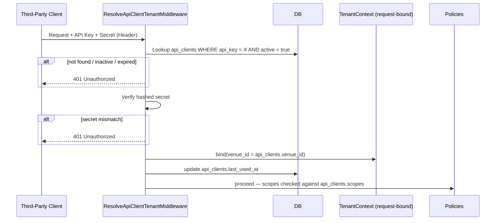
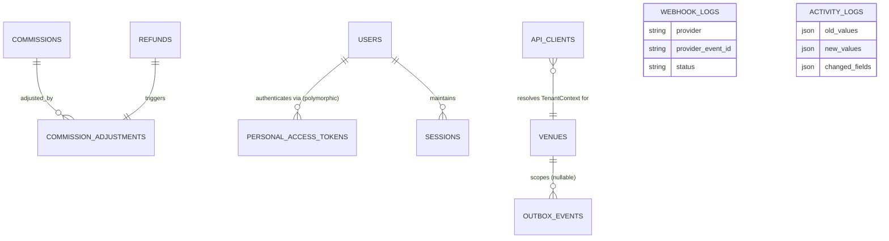

# منصة تذاكر الفعاليات متعددة المستأجرين — الوثيقة المعمارية v1.3

**الحالة:** v1.2 مقفلة وثابتة بالكامل. هذه الوثيقة تضيف فقط: جداول جديدة، أعمدة Nullable/Default، فهارس، Unique Constraints، FK Constraints، وقواعد تطبيقية (Application Rules). لا يوجد أي تعديل على تسمية، أو Enum، أو علاقة، أو تدفق (Payment / Reservation / Check-in / Event Lifecycle) موجود مسبقًا. الترقيم يكمل من v1.2 (المنتهية عند §49).

---

## 50. Soft Delete Safe Unique Constraints

**سبب الإضافة:**
تم رصد هذه المشكلة في مراجعة v1.2 (البند الحرج الأول) ولم تُحل فعليًا حتى الآن: بمجرد تفعيل Soft Delete على `venues`, `events`, وامتداده الآن إلى `coupons` و`promo_codes`، فإن أي Unique Constraint تقليدي يبقى ساريًا على الصفوف المحذوفة منطقيًا (Soft Deleted)، مما يمنع إعادة استخدام نفس القيمة (subdomain، slug، code) مستقبلًا حتى بعد "حذف" السجل.

**تصميم الحل — يختلف حسب قاعدة البيانات المستهدفة:**

### PostgreSQL (الحل الموصى به إن كان هو المستهدف)
يدعم PostgreSQL **Partial Unique Indexes** بشكل أصلي، وهو الحل الأنظف:

```sql
CREATE UNIQUE INDEX venues_subdomain_unique
  ON venues (subdomain) WHERE deleted_at IS NULL;

CREATE UNIQUE INDEX events_venue_slug_unique
  ON events (venue_id, slug) WHERE deleted_at IS NULL;

CREATE UNIQUE INDEX coupons_venue_code_unique
  ON coupons (venue_id, code) WHERE deleted_at IS NULL;

CREATE UNIQUE INDEX promo_codes_venue_code_unique
  ON promo_codes (venue_id, code) WHERE deleted_at IS NULL;
```
*(هذا SQL توضيحي لسلوك الفهرس المطلوب — وليس Migration فعليًا، بحسب طلبك بعدم توليد كود.)*

### MySQL (إن كان هو المستهدف بدلاً من PostgreSQL)
MySQL/InnoDB لا يدعم Partial Indexes أصلاً حتى الإصدارات الحديثة. البديل القياسي والمعتمد صناعيًا هو **Generated Column + Unique Index**، بالاستفادة من كون InnoDB يعامل قيم `NULL` المتعددة في عمود Unique كقيم غير متكررة (Distinct):

- إضافة عمود محسوب (Generated, Stored) لكل جدول، يُرجع القيمة الفعلية فقط عندما يكون `deleted_at IS NULL`، ويُرجع `NULL` غير ذلك:
  - `venues.subdomain_active` = `IF(deleted_at IS NULL, subdomain, NULL)`
  - `events.slug_active` = `IF(deleted_at IS NULL, CONCAT(venue_id, '-', slug), NULL)`
  - `coupons.code_active` = `IF(deleted_at IS NULL, CONCAT(venue_id, '-', code), NULL)`
  - `promo_codes.code_active` = `IF(deleted_at IS NULL, CONCAT(venue_id, '-', code), NULL)`
- ثم إنشاء Unique Index على العمود المحسوب بدلاً من العمود الأصلي.

**الأعمدة الجديدة المطلوبة (إضافية فقط):**

| الجدول | العمود الجديد | ملاحظة |
|---|---|---|
| `coupons` | `deleted_at` (nullable timestamp) | امتداد Soft Delete — لم يكن موجودًا في v1.1/v1.2، وهو مطلوب أصلًا لتفعيل هذا الحل، ومُوصى به سابقًا في مراجعة v1.2 |
| `promo_codes` | `deleted_at` (nullable timestamp) | نفس السبب |
| (MySQL فقط) `venues`, `events`, `coupons`, `promo_codes` | `*_active` generated column | فقط إذا كان MySQL هو المحرك المستهدف |

**العلاقات:** لا تغيير — الأعمدة الجديدة لا تُنشئ أي علاقة جديدة.

**الفهارس:** الفهرس الجزئي (PostgreSQL) أو فهرس العمود المحسوب (MySQL) يحل محل الحاجة لأي فهرس Unique تقليدي إضافي؛ الفهرس القديم (إن وجد على `subdomain` مباشرة دون شرط) يجب استبداله، لا حذفه من التطبيق — هذا تغيير في تعريف الفهرس فقط، وليس في العمود أو الجدول نفسه.

**قواعد العمل:**
- أي منطق تطبيقي يتحقق من توفر subdomain/slug/code يجب أن يستعلم دائمًا ضمن نطاق `deleted_at IS NULL` بشكل صريح، حتى مع وجود الفهرس، لضمان اتساق منطق التحقق مع منطق قاعدة البيانات.

**التأثير على Multi-Tenant:** لا تغيير في آلية العزل؛ هذا يعالج فقط تفرد القيمة ضمن أو عبر المستأجرين حسب الحالة (subdomain عالمي، slug/code ضمن نطاق venue_id).

**التأثير على الأداء:** تحسين طفيف أو معدوم — الفهرس الجزئي أصغر حجمًا من فهرس تقليدي لأنه يستثني الصفوف المحذوفة.

**التأثير على الأمان:** لا تأثير مباشر، لكنه يمنع خطأ تشغيلي (عدم القدرة على إعادة تفعيل subdomain) قد يُستغل لاحقًا كمشكلة إتاحة (Availability).

**لماذا ليس Breaking Change:** لا تغيير في أسماء الأعمدة أو الجداول أو العلاقات الحالية؛ الإضافة الوحيدة (`deleted_at` على `coupons`/`promo_codes`) هي عمود Nullable قياسي يتبع نفس نمط الجداول الست التي تدعم Soft Delete أصلًا في v1.1 §29.

---

## 51. Webhook Idempotency

**سبب الإضافة:**
بوابات الدفع (مثل ShamCash) تُعيد إرسال نفس الـ Webhook أكثر من مرة كسلوك طبيعي (At-Least-Once Delivery)، وليس استثناءً. دون معرّف فريد لكل حدث webhook، يمكن معالجة نفس الدفعة مرتين، مما قد يُنشئ سجل `payment_transactions` مكرر أو يُشغّل معالجة استرجاع مرتين.

**تصميم العمود/الجدول:**

إضافة إلى `webhook_logs` (v1.1 §25) — أعمدة إضافية فقط:

| العمود | النوع | ملاحظة |
|---|---|---|
| `provider_event_id` | string, nullable عند الإدخال الأولي قبل التحقق، لكن **يجب تعبئته دائمًا فعليًا** من الحمولة (Payload) قبل أي معالجة | معرّف الحدث كما ترسله بوابة الدفع نفسها — يختلف عن `payment_transactions.provider_transaction_id` (الذي يمثل المعاملة المالية، لا الحدث/الإشعار) |

**الفهارس:**
- `UNIQUE (provider, provider_event_id)` — هذا هو الضامن الفعلي لعدم التكرار على مستوى قاعدة البيانات، وليس فقط منطق التطبيق.
- `INDEX (status)` لاستعلام العامل (Worker) الذي يعيد محاولة معالجة السجلات المعلّقة/الفاشلة.

**العلاقات:** لا تغيير في علاقات `webhook_logs` الحالية.

**قواعد العمل (إلزامية):**
```
Receive Webhook
   ↓
Verify Signature   (رفض فوري إذا فشل التحقق — لا يُسجَّل حتى كمحاولة معالجة)
   ↓
Idempotency Check  (محاولة إدراج provider_event_id ضمن قيد UNIQUE)
   ├── إذا فشل الإدراج بسبب تكرار القيد → الحدث مُعالج مسبقًا → إرجاع نفس النتيجة السابقة دون أي تأثير جديد
   └── إذا نجح الإدراج → هذه أول معالجة فعلية لهذا الحدث
   ↓
Process (Business Logic)
   ↓
Update Payment (payment_transactions / orders)
```
النقطة الحرجة: التحقق من التكرار **يجب أن يعتمد على قيد Unique في قاعدة البيانات فعليًا** (عبر `INSERT ... ON CONFLICT DO NOTHING` في PostgreSQL أو ما يعادلها في MySQL)، وليس فقط على استعلام `SELECT` مسبق — لأن استعلام Select-then-Insert عرضة لحالة سباق (Race Condition) إذا وصل نفس الـ Webhook مرتين بفارق ميلي ثانية.

**التأثير على Multi-Tenant:** `webhook_logs` جدول عالمي (Platform-level) أصلًا كما وُثّق في v1.1 — لا تغيير في نطاق العزل؛ ربط الحدث بـ `venue_id` (إن وُجد) يتم لاحقًا عند معالجة `payment_transactions`، لا عند استقبال الـ Webhook نفسه.

**التأثير على الأداء:** فهرس Unique إضافي واحد، تكلفة كتابة ضئيلة جدًا مقابل حماية كاملة من ازدواجية المعالجة.

**التأثير على الأمان:** هذا تحسين أمني مباشر — يمنع استغلال إعادة إرسال Webhook (متعمدة أو غير متعمدة) للتأثير على حالة الدفع أكثر من مرة.

**لماذا ليس Breaking Change:** عمود جديد Nullable + فهرس Unique جديد على جدول موجود؛ لا تغيير في أي عمود أو enum سابق في `webhook_logs`.

---

## 52. Commission Adjustments

**سبب الإضافة:**
بند حرج من مراجعة v1.2: `commissions` يُكتب مرة واحدة فقط عند الطلب ولا يُعدَّل عند الاسترجاع (Refund)، رغم أن العمولة هي مصدر الدخل الوحيد للمنصة. المطلوب دعم استرجاع العمولة **دون تعديل تصميم `commissions` الحالي إطلاقًا**.

**تصميم الجدول الجديد:**

### `commission_adjustments`
| العمود | النوع | ملاحظة |
|---|---|---|
| `id` | bigint PK | |
| `venue_id` | FK, indexed | اتساقًا مع نمط العزل في كل جدول مستأجر |
| `commission_id` | FK → commissions | العمولة الأصلية التي يخصها هذا التعديل |
| `refund_id` | FK → refunds, **unique** | كل Refund يُنتج تعديل عمولة واحدًا بالضبط — هذا ما يجعل Partial/Multiple Refunds قابلة للتتبع دون غموض: كل استرجاع = صف تعديل واحد مرتبط به مباشرة |
| `adjustment_amount` | decimal(10,2) | قيمة سالبة تمثل مقدار خصم العمولة الناتج عن هذا الاسترجاع المحدد |
| `rate_snapshot` | decimal(5,2) | نسخة من `commissions.rate` وقت إنشاء التعديل — لضمان أن التعديل يعكس النسبة التي طُبّقت أصلًا، حتى لو تغيّر `venues.commission_rate` لاحقًا |
| `created_at` | timestamp | سجل غير قابل للتعديل (Append-only)، بلا `updated_at` — نفس نمط `activity_logs`/`webhook_logs` |

**العلاقات:**
- `commissions (1) → commission_adjustments (N)` — عمولة واحدة قد تخضع لعدة استرجاعات جزئية عبر الزمن، كل واحد صف مستقل.
- `refunds (1) → commission_adjustments (1)` — علاقة واحد-لواحد، لأن كل حدث استرجاع يُنتج بالضبط تعديل عمولة واحدًا يقابله.

**الفهارس:** `(commission_id)`, `(refund_id)` unique, `(venue_id)`.

**قواعد العمل:**
- `adjustment_amount = refunds.amount × commission_adjustments.rate_snapshot` — يُحسب ويُخزَّن ضمن نفس المعاملة (Transaction) التي يتحول فيها `refunds.status` إلى `processed`.
- **صافي العمولة المستحقة** لأي طلب يُحسب دائمًا كـ:
  `commissions.amount − SUM(commission_adjustments.adjustment_amount WHERE commission_id = X)`
  — هذا يُحافظ حرفيًا على عدم تعديل `commissions.amount` نفسه كما طُلب، بينما يمنح صافيًا دقيقًا عبر الجمع.
- استرجاع كامل (Full Refund) يُنتج تعديلًا واحدًا بقيمة تُساوي كامل `commissions.amount`؛ استرجاعات جزئية متعددة تُنتج عدة صفوف تتراكم حتى الوصول لنفس السقف كحد أقصى (يُفرض على مستوى `RefundService`، وليس عبر قيد قاعدة بيانات).

**التأثير على Multi-Tenant:** الجدول يحمل `venue_id` بنفس نمط `commissions`/`refunds` — لا يوجد أي تغيير في حدود العزل.

**التأثير على الأداء:** جدول صغير الحجم نسبيًا (صف واحد لكل حدث استرجاع، وليس لكل طلب) — لا قلق أداء يُذكر حتى في حجم كبير من الطلبات.

**التأثير على الأمان:** يُحسّن قابلية التدقيق المالي (Auditability) بشكل مباشر — يمنح مسارًا واضحًا وقابلًا للتتبع لكل خصم عمولة، وهو أمر ضروري تحسبًا لأي نزاع مالي مستقبلي مع أحد الأماكن (Venues).

**لماذا ليس Breaking Change:** جدول جديد بالكامل؛ صفر تعديل على أعمدة أو علاقات `commissions` أو `refunds` الحالية — وهو بالضبط ما طُلب صراحة ("بدون تعديل تصميم commissions الحالي").

---

## 53. API Client Tenant Resolution — توثيق صريح (بدون تغيير مخطط)

**سبب الإضافة:**
بند حرج من مراجعة v1.2: معمارية تحديد المستأجر الموثقة أصلًا (v1.0 §2) تعتمد كليًا على الـ Subdomain عبر `ResolveTenantMiddleware`. لا يوجد مسار مواز موثق لكيفية ربط `TenantContext` عندما يكون الطلب قادمًا عبر `api_clients` (v1.2 §38)، والتي تُصادق عبر `api_key`/`secret` لا عبر Subdomain إطلاقًا. هذا لا يتطلب أي عمود أو جدول جديد — `api_clients.venue_id` موجود أصلًا منذ v1.2 — المطلوب هو توثيق المسار كقاعدة معمارية صريحة وإلزامية.

**المسار المعماري الإلزامي (Middleware مستقل، وليس امتدادًا لمسار الـ Subdomain):**



**قاعدة معمارية صريحة (إلزامية):**
- هذا الـ Middleware **مستقل تمامًا** عن `ResolveTenantMiddleware` الخاص بالـ Subdomain — لا يُستدعى الأخير إطلاقًا على مسارات API الخاصة بـ `api_clients`؛ الطلب إما يمر عبر مسار Subdomain (تطبيق الويب/الموبايل للمستخدمين) أو عبر مسار API Key (تكاملات الطرف الثالث)، ولا يوجد مسار ثالث مختلط.
- `TenantContext` المُنشأ من كلا المسارين متطابق في الشكل (نفس الكائن/الواجهة)، بحيث تبقى `BelongsToVenue` Global Scope (v1.0) تعمل دون أي تمييز بين مصدر الطلب — هذا ما يضمن عدم الحاجة لأي تغيير في طبقة الـ Service أو الـ Repository.
- أي محاولة وصول عبر `api_clients` بدون نجاح هذا الـ Middleware يجب أن تُرفض قبل الوصول لأي Controller — لا استثناءات.

**التأثير على Multi-Tenant:** هذا **يُغلق** الثغرة الحرجة المرصودة في المراجعة، دون تغيير حدود العزل نفسها — فقط يوضح آلية الوصول إليها من مسار مصادقة مختلف.

**التأثير على الأداء:** استعلام إضافي واحد (بحث `api_clients` بمفتاح مفهرس `api_key`) لكل طلب API خارجي — مقبول تمامًا ويمكن تخزينه مؤقتًا (Cache) بنفس نمط تخزين الـ Venue بالـ subdomain (v1.0 §2).

**التأثير على الأمان:** إغلاق مباشر لثغرة عزل حرجة — بدون هذا المسار الموثق صراحة، تكامل طرف ثالث معطوب أو خبيث قد يعمل خارج أي نطاق عزل مستأجر بالكامل.

**لماذا ليس Breaking Change:** لا تغيير في أي جدول أو عمود — `api_clients.venue_id` موجود مسبقًا؛ هذا توثيق لقاعدة تطبيقية إلزامية فقط.

---

## 54. Permission Escalation Protection — قاعدة أمنية صريحة (بدون تغيير مخطط)

**سبب الإضافة:**
بند حرج من مراجعة v1.2: نظام `user_permissions` (v1.2 §42) سليم التصميم، لكن لا يوجد نص صريح يمنع تصعيد الصلاحيات (Privilege Escalation) عبر الكتابة غير المقيدة على هذا الجدول نفسه.

**قواعد أمنية صريحة (إلزامية، بدون أي تغيير في تصميم الجداول):**

1. **فقط `owner` (على مستوى `venue_user.role`) أو Super Admin (`users.is_super_admin = true`)** يملكان صلاحية الكتابة (إنشاء/تعديل/حذف) على أي صف في `user_permissions`. هذا يُفرض عبر `Policy` مخصص (`UserPermissionPolicy`) يُستدعى قبل أي عملية Grant/Revoke — بلا استثناء لأي دور آخر مهما كانت صلاحياته الأخرى.
2. **كل عملية Grant أو Revoke على `user_permissions` تُسجَّل إلزاميًا في `activity_logs`** (v1.0 §14، والذي يحتوي أصلًا على `old_values`/`new_values`) — هذا التسجيل ليس اختياريًا نظرًا لحساسية هذا النوع من التعديلات؛ يجب أن يتضمن `actor_user_id`, القيمة قبل وبعد، و`ip_address`.
3. **Staff لا يمكنه منح نفسه أي صلاحية جديدة تحت أي ظرف** — حتى لو امتلك صلاحية إدارية أخرى غير متعلقة، لأن الكتابة على `user_permissions` مقيدة بالكامل بالقاعدة رقم 1 وليست صلاحية تُمنح أو تُسحب مثل بقية الصلاحيات؛ هي استثناء بنيوي (Hard-coded Rule)، لا صلاحية ضمن الكتالوج (`permissions` table).

**التأثير على Multi-Tenant:** لا تغيير — القاعدة تُطبَّق ضمن نطاق `venue_id` الحالي لـ `user_permissions` (owner لمنشأة معينة يمنح/يسحب فقط ضمن تلك المنشأة).

**التأثير على الأداء:** لا تأثير — هذه قاعدة تفويض (Authorization)، لا تغيير في الاستعلامات.

**التأثير على الأمان:** يُغلق ثغرة تصعيد صلاحيات حرجة كانت مرصودة كخطر مفتوح.

**لماذا ليس Breaking Change:** لا تغيير في أي جدول أو عمود — قاعدة تطبيقية (Application Rule) بحتة.

---

## 55. Authentication Infrastructure

**سبب الإضافة:**
بند حرج من مراجعة v1.2: نظام أدوار وصلاحيات كامل (Super Admin / Venue Owner / Staff / Customer) مصمَّم عبر v1.0–v1.2 دون وجود جداول المصادقة القياسية التي يعتمد عليها Laravel لتسجيل الدخول، إعادة تعيين كلمة المرور، أو إصدار التوكنات (لتطبيق الموبايل مثلًا).

**الاختيار المعتمد: Laravel Sanctum** — الأنسب هنا لأن المنصة تخدم عدة أنواع "عملاء" (Web SPA للمستخدمين، تطبيق موبايل للعملاء، ولوحات إدارة للـ Owner/Staff) دون الحاجة لتعقيد OAuth2 الكامل الذي يوفره Passport — Sanctum يغطي كلًا من مصادقة SPA بالكوكيز ومصادقة API بالتوكن بجدول واحد فقط.

### `personal_access_tokens` (شكل Laravel/Sanctum القياسي، دون أي تعديل)
| العمود | النوع |
|---|---|
| `id` | bigint PK |
| `tokenable_type` | string (polymorphic) |
| `tokenable_id` | bigint |
| `name` | string |
| `token` | string, unique (hashed) |
| `abilities` | text, nullable |
| `last_used_at` | datetime, nullable |
| `expires_at` | datetime, nullable |
| `timestamps` | |

### `sessions` (إذا كان Session Driver = database)
| العمود | النوع |
|---|---|
| `id` | string PK |
| `user_id` | bigint, nullable, indexed |
| `ip_address` | string, nullable |
| `user_agent` | text, nullable |
| `payload` | longtext |
| `last_activity` | int, indexed |

### `password_reset_tokens` (شكل Laravel القياسي)
| العمود | النوع |
|---|---|
| `email` | string, Primary Key |
| `token` | string |
| `created_at` | timestamp, nullable |

**العلاقات:** `personal_access_tokens.tokenable_type/id` علاقة Polymorphic تربط مع `users` (النمط نفسه المستخدم أصلًا في `media`/`documents` — اتساق كامل مع الاصطلاح المعماري القائم). `sessions.user_id` FK اختياري إلى `users`.

**الفهارس:** `personal_access_tokens(token)` unique، `sessions(user_id)`، `sessions(last_activity)`، `password_reset_tokens(email)` (PK بالفعل).

**قواعد العمل:**
- إصدار توكن Sanctum يتم فقط بعد مصادقة ناجحة (بريد/كلمة مرور أو OTP حسب نوع المستخدم)؛ `abilities` يمكن أن تعكس نطاقًا مشابهًا لمنطق `scopes` في `api_clients` (v1.2 §38) لكنها منفصلة تمامًا عنه — `personal_access_tokens` لمصادقة المستخدمين البشريين، `api_clients` لتكاملات الطرف الثالث فقط.

**التأثير على Multi-Tenant:** هذه الجداول عالمية بطبيعتها (مرتبطة بـ `users`، وهو جدول عالمي أصلًا) — لا حاجة لـ `venue_id` هنا، بنفس منطق `users` نفسه.

**التأثير على الأداء:** جداول قياسية خفيفة، منخفضة النمو نسبيًا مقارنة بجداول العمليات (`orders`/`tickets`).

**التأثير على الأمان:** يُغلق فجوة بنيوية حرجة — دون هذه الجداول، لا يوجد أساس فعلي لتسجيل الدخول أو إعادة تعيين كلمة المرور لأي دور من الأدوار الأربعة المصممة أصلًا.

**لماذا ليس Breaking Change:** ثلاثة جداول قياسية جديدة بالكامل بنفس شكل Laravel الافتراضي دون أي تعديل عليها؛ صفر تأثير على أي جدول موجود.

---

## 56. Webhook Signature Verification — قاعدة معمارية صريحة (بدون تغيير مخطط)

**سبب الإضافة:**
بند حرج من مراجعة v1.2: تخزين `webhook_logs.signature` (v1.1 §25) يوحي بالتحقق لكن لا يوجد نص إلزامي صريح يمنع أي Webhook غير موثّق من التأثير على `orders`/`payment_transactions`/`refunds`.

**القاعدة المعمارية الإلزامية (تدفق واحد لا يجوز تجاوزه):**

```
Receive
   ↓
Verify Signature        ← إلزامي، أول خطوة بعد الاستقبال مباشرة
   ↓ (فشل → تسجيل status = failed في webhook_logs فقط، رفض فوري، توقف كامل)
Store Webhook           ← تسجيل الحمولة الكاملة (payload) + التوقيع في webhook_logs، status = verified
   ↓
Idempotency Check       ← اعتمادًا على §51 أعلاه (provider_event_id + Unique Constraint)
   ↓ (مكرر → توقف، إرجاع نفس النتيجة السابقة دون أي تأثير جديد)
Business Processing     ← فقط بعد اجتياز التحقق والتفرد معًا
   ↓
Payment Update          ← التأثير الفعلي الوحيد المسموح به على orders / payment_transactions / refunds
```

**قاعدة صريحة:** لا يُسمح تحت أي ظرف بالوصول إلى مرحلة "Business Processing" أو "Payment Update" دون اجتياز كل من مرحلتي التحقق من التوقيع **و** فحص التفرد معًا — هما شرطان متلازمان، وليسا بديلين لبعضهما.

**التأثير على Multi-Tenant:** لا تغيير.

**التأثير على الأداء:** لا تغيير إضافي بخلاف ما ذُكر في §51.

**التأثير على الأمان:** يُغلق ثغرة انتحال Webhook (Webhook Spoofing) بشكل صريح وإلزامي — وهي من أخطر نقاط الهجوم المحتملة على أي نظام دفع.

**لماذا ليس Breaking Change:** قاعدة تطبيقية بحتة، تُشكِّل فقط توثيقًا صريحًا لتدفق كان ضمنيًا سابقًا.

---

## 57. Outbox Pattern

**سبب الإضافة:**
حاليًا، إرسال الإشعارات (`notifications`, v1.1 §21)، البريد الإلكتروني، الرسائل النصية، وأي تكامل مستقبلي، قد يتم استدعاؤه مباشرة من داخل Transaction قاعدة البيانات (مثل تأكيد الدفع). هذا يخلق خطر عدم اتساق: قد يُرسل بريد تأكيد ثم تفشل المعاملة وتُلغى (Rollback)، أو العكس. نمط Outbox يفصل "تسجيل نية الإرسال" (ضمن نفس Transaction الناجحة) عن "الإرسال الفعلي" (لاحقًا، عبر Worker منفصل).

### `outbox_events`
| العمود | النوع | ملاحظة |
|---|---|---|
| `id` | bigint PK | |
| `venue_id` | FK, nullable | null لأحداث على مستوى المنصة |
| `event_type` | string | مثل `order.paid`, `ticket.checked_in`, `commission.adjusted`, `refund.processed` |
| `aggregate_type` | string | اسم الكيان المصدر، مثل `Order`, `Ticket` — نفس نمط `activity_logs.entity_type` (v1.0 §14) للاتساق |
| `aggregate_id` | bigint | |
| `payload` | json | البيانات اللازمة للمستهلك (Consumer) لتنفيذ الإرسال دون الحاجة لإعادة الاستعلام عن الكيان الأصلي بالضرورة |
| `status` | enum(pending, processing, sent, failed) | |
| `attempts` | int, default 0 | لدعم إعادة المحاولة مع Backoff |
| `processed_at` | datetime, nullable | |
| `timestamps` | | |

**العلاقات:** لا FK رسمي إلى الكيان المصدر (نمط Polymorphic غير مقيّد، بنفس فلسفة `activity_logs`) — لأن `aggregate_type` يمتد عبر جداول كثيرة ومتنوعة.

**الفهارس:** `(status, created_at)` — مسار الاستعلام الأساسي لعامل المعالجة (Worker) الذي يسحب السجلات `pending`. `(aggregate_type, aggregate_id)` لتتبع كل الأحداث المرتبطة بكيان معيّن عند التدقيق.

**قواعد العمل:**
- إنشاء صف `outbox_events` يتم **إلزاميًا ضمن نفس Transaction** التي تُنجز التغيير الفعلي في قاعدة البيانات (مثل تحديث `orders.status = paid`) — إما ينجح كلاهما معًا أو يفشل كلاهما معًا (Atomicity).
- **لا يجوز إطلاقًا** استدعاء إرسال بريد/رسالة نصية/إشعار/تكامل خارجي مباشرة داخل أي Transaction — يقتصر التأثير المباشر داخل الـ Transaction على إدراج صف Outbox فقط.
- Queue Worker منفصل (غير متزامن) يسحب الصفوف `pending`، يُنفّذ الإرسال الفعلي (عبر `notifications`, `email_templates`, `sms_templates` الموجودة أصلًا)، ثم يُحدّث `status` إلى `sent` أو `failed` (مع زيادة `attempts`).
- هذا **لا يُغيّر أي Service موجود** — هو طبقة إضافية تلتقط الحدث بعد نجاح المعاملة، دون التدخل في منطق `OrderService`/`CheckInService`/إلخ.

**التأثير على Multi-Tenant:** `venue_id` nullable يحافظ على نفس نمط العزل المستخدم في `notifications`/`webhook_logs` — أحداث خاصة بمنشأة معينة تُعزل، أحداث المنصة تبقى عامة.

**التأثير على الأداء:** يُحسّن الأداء الفعلي للمسار الحرج (Checkout/Check-in) لأنه يُزيل استدعاءات شبكة بطيئة (بريد/SMS) من داخل الـ Transaction نفسها؛ الكلفة الإضافية محصورة في كتابة صف واحد صغير.

**التأثير على الأمان:** يُقلّل من مخاطر تسريب حالة غير متسقة (كإرسال تأكيد دفع لطلب فشل فعليًا)، وهو مصدر شائع لمشاكل ثقة العملاء والمنازعات.

**لماذا ليس Breaking Change:** جدول جديد بالكامل، ولا تعديل على أي Service أو جدول موجود — كما طُلب صراحة.

---

## 58. Optimistic Locking

**التوصية المعتمدة: عمود `version` صريح — وليس الاعتماد على `updated_at`.**

**سبب التوصية:**
`updated_at` غير موثوق كـ Token لـ Optimistic Locking لثلاثة أسباب: (1) دقة الطابع الزمني قد لا تكفي للتمييز بين تعديلين خلال نفس الثانية (شائع مع الأتمتة أو نقرات مزدوجة سريعة)، (2) بعض عمليات التحديث الجماعي (Bulk Update) لا تُحدّث `updated_at` تلقائيًا ما لم تُفرض صراحة، (3) فروقات المناطق الزمنية/تزامن الساعات (Clock Skew) بين عدة عمليات تطبيق (App Instances) قد تُنتج مقارنات غير دقيقة. عمود `version` عدد صحيح يضمن مقارنة تسلسلية (Strict Monotonic) بغض النظر عن التوقيت.

**الجداول التي يُضاف إليها `version` (إضافي، Default = 1):**

| الجدول | السبب |
|---|---|
| `events` | تعديلات متزامنة محتملة من أكثر من Staff/Owner على نفس الفعالية |
| `ticket_types` | تعديل السعر/الكمية من واجهة الإدارة، احتمال تعديل متزامن منخفض لكن حساس ماليًا |
| `venues` | تعديل `theme_config`/`commission_rate` من أكثر من مستخدم إداري |
| `platform_settings` | صف واحد فقط (Singleton) لكنه معرّض لتعديل متزامن من أكثر من Super Admin |
| `tax_rates` | تعديل إداري غير متكرر لكنه حساس ماليًا |

**لماذا لا يُضاف إلى الجداول المعاملاتية عالية التزامن (`orders`, `tickets`, `payment_transactions`):**
هذه الجداول محمية أصلًا بآلية **Pessimistic Locking** (`lockForUpdate`) الموثقة في v1.0 (لـ `ticket_types.quantity_sold`) و`ticket_serial_counters` — وهي الآلية الصحيحة عندما يكون التسلسل الصارم (Strict Serialization) مطلوبًا تحت تزامن عالٍ وحقيقي (Checkout). إضافة `version` هناك ستكون تكرارًا زائدًا، وقد تتعارض مع منطق القفل التشاؤمي المصمم أصلًا — وهذا يُبقي "عدم تغيير Payment Flow" ساريًا حرفيًا كما طُلب.

**قواعد العمل:**
- كل تحديث على الجداول المذكورة أعلاه يجب أن يتضمن شرط `WHERE version = :current_version` ضمن جملة الـ `UPDATE`، ثم يزيد `version` بمقدار 1 عند النجاح؛ إذا كان عدد الصفوف المتأثرة صفرًا، يُعتبر ذلك تعارض تحديث (Conflict) يُرجَع للمستخدم لإعادة المحاولة بعد تحديث البيانات المعروضة له.

**التأثير على Multi-Tenant:** لا تغيير — `version` عمود إضافي محايد تمامًا تجاه نطاق العزل.

**التأثير على الأداء:** تكلفة شبه معدومة (مقارنة عدد صحيح إضافية ضمن WHERE أصلًا موجود).

**التأثير على الأمان:** يمنع فقدان تحديثات (Lost Updates) قد تُستغل نظريًا لإخفاء تعديل ضار وسط تعديلات متزامنة شرعية (مثال: تعديل خبيث على `commission_rate` يُطمَس بتحديث لاحق شرعي دون أن يُلاحظه أحد).

**لماذا ليس Breaking Change:** أعمدة إضافية Default = 1 على جداول موجودة فقط؛ لا تغيير في أي عمود أو Enum سابق.

---

## 59. Audit Trail Improvements

**سبب الإضافة والتوضيح المهم:**
`activity_logs` يحتوي فعليًا منذ v1.0 §14 على `old_values` و`new_values` بصيغة JSON — هذا الجزء من المتطلب **مُلبّى أصلًا في التصميم الحالي ولا يتطلب أي عمود جديد**. ما تضيفه v1.3 هنا هو (أ) عمود مساعد اختياري لتحسين قابلية الاستعلام، و(ب) توثيق صريح وإلزامي لقائمة العمليات التي *يجب* أن تُسجَّل فيها القيم قبل وبعد التعديل دون استثناء.

**عمود إضافي واحد (اختياري، تحسين أداء استعلام فقط):**

| الجدول | العمود الجديد | ملاحظة |
|---|---|---|
| `activity_logs` | `changed_fields` (json, nullable) | مصفوفة بأسماء الحقول التي تغيّرت فقط (مثال: `["price", "commission_rate"]`) — تُمكّن استعلامات سريعة مثل "أظهر كل مرة تغيّر فيها `commission_rate`" دون الحاجة لتحليل (Parse) كامل `old_values`/`new_values` في كل استعلام |

**قائمة العمليات التي يجب أن تُسجِّل `old_values`/`new_values` بشكل إلزامي (بدون استثناء):**

| العملية | الجدول المتأثر |
|---|---|
| تعديل الأسعار | `ticket_types.price`, `products.price`, `product_variants.price_override` |
| تعديل الصلاحيات | `user_permissions` (Grant/Revoke — إلزامي أصلًا حسب §54)، `role_permissions` |
| تعديل نسب العمولة | `venues.commission_rate`, `platform_settings.commission_rate` |
| إعدادات الدفع | أي تعديل على `tax_rates`, إعدادات `api_clients.scopes` |
| إعدادات المنصة | أي تعديل على أي عمود في `platform_settings` (بما أنه صف واحد شديد الحساسية) |

**قواعد العمل:**
- يُنفَّذ هذا عبر Observer واحد لكل نموذج (Model Observer)، وليس عبر استدعاءات يدوية متفرقة داخل الـ Services — بنفس التوصية الأصلية في v1.0 §14 لضمان عدم إفلات أي تعديل من التسجيل.
- الحقول المذكورة أعلاه تحديدًا **لا يجوز** أن تُسجَّل بصيغة "تم التعديل" فقط دون القيم الفعلية — يجب أن تحتوي `old_values`/`new_values` على القيمة الرقمية/النصية الكاملة قبل وبعد، نظرًا لحساسيتها المالية والأمنية المباشرة.

**التأثير على Multi-Tenant:** لا تغيير — `activity_logs.venue_id` (nullable) يُغطي هذا أصلًا.

**التأثير على الأداء:** عمود `changed_fields` الإضافي صغير الحجم؛ الفائدة (تسريع استعلامات التدقيق الشائعة) تفوق كلفته البسيطة.

**التأثير على الأمان:** يُحسّن قابلية التدقيق (Auditability) لأكثر العمليات حساسية في النظام بأكمله — الأسعار، الصلاحيات، العمولات، وإعدادات المنصة — وهي بالضبط الأهداف التي يستهدفها أي مهاجم داخلي (Insider Threat).

**لماذا ليس Breaking Change:** عمود إضافي واحد Nullable؛ الأعمدة الأساسية (`old_values`, `new_values`) كانت موجودة أصلًا ولم تُحذف أو تُعدَّل.

---

## 60. Updated ERD (v1.3)



*(كل علاقات v1.0–v1.2 — Venues↔Events↔TicketTypes↔Orders↔Tickets↔Commissions↔Refunds↔PaymentTransactions، Zones↔VenueTables↔TableSeats↔Reservations، Categories↔Events، Coupons/PromoCodes↔Orders، وغيرها — تبقى كما هي دون أي تغيير؛ راجع v1.0 §17، v1.1 §30، وv1.2 §48 لتلك المخططات.)*

### قائمة الجداول الجديدة في v1.3
`commission_adjustments`, `personal_access_tokens`, `sessions`, `password_reset_tokens`, `outbox_events`.

### قائمة الأعمدة الجديدة/المعدَّلة على جداول موجودة

| الجدول | العمود الجديد | Nullable/Default |
|---|---|---|
| `coupons` | `deleted_at` | nullable |
| `promo_codes` | `deleted_at` | nullable |
| `webhook_logs` | `provider_event_id` | nullable عند الإدخال، unique مع `provider` |
| `events`, `ticket_types`, `venues`, `platform_settings`, `tax_rates` | `version` | default 1 |
| `activity_logs` | `changed_fields` | nullable |

*(فهارس Unique الجزئية/المحسوبة على `venues.subdomain`, `events.slug`, `coupons.code`, `promo_codes.code` — راجع §50 — هي تعديل في تعريف الفهرس فقط، لا عمود جديد بخلاف `deleted_at` المذكور أعلاه.)*

---

## 61. Updated Normalization Review

- `commission_adjustments` كجدول منفصل (لا كعمود إضافي على `commissions`) هو القرار الصحيح تمامًا — يحافظ على `commissions` كسجل ثابت غير قابل للتعديل لكل طلب، بينما يسمح بعدد غير محدود من التعديلات التراكمية دون كسر هذا الثبات. هذا يطابق نفس فلسفة الفصل بين `payment_transactions` و`refunds` (v1.2 §32–33).
- `outbox_events` كجدول Polymorphic-style عام (بدون FK صريح لكل نوع Aggregate) هو نفس النمط المُستخدم بنجاح في `activity_logs` — قرار سليم لتفادي عشرات الجداول الوسيطة المتشابهة.
- عمود `changed_fields` على `activity_logs` هو تكرار محسوب (Derived/Denormalized) مقصود من `old_values`/`new_values` — مقبول ومبرَّر بوضوح لأنه تحسين استعلام بحت، وليس مصدر حقيقة إضافيًا.
- لا توجد أي مشكلة تطبيع جديدة نتجت عن أي إضافة في v1.3.

## 62. Updated Scalability Review

- `commission_adjustments` ينمو بمعدل "حدث استرجاع واحد"، أبطأ بكثير من `orders`/`tickets` — لا قلق حجمي.
- `outbox_events` سينمو بمعدل مشابه لـ `notifications`/`activity_logs` (المرصودة سابقًا للحاجة لأرشفة/استبقاء) — يُضاف إلى نفس قائمة الجداول التي تحتاج سياسة استبقاء واضحة (مطروحة سابقًا في v1.1 §31 وv1.2 §49)، لا تُعتبر مشكلة جديدة بل امتدادًا لمشكلة مرصودة أصلًا.
- إضافة فهرس Unique جزئي (بدلاً من فهرس تقليدي) على `venues.subdomain`/`events.slug`/إلخ تُحسّن الأداء والحجم قليلًا، لا تُضعفه.
- `personal_access_tokens`/`sessions` جداول قياسية معروفة النمو والسلوك ضمن أي تطبيق Laravel بحجم مماثل — لا قلق يُذكر حتى عند 10,000 منشأة.

## 63. Updated Security Review

جميع البنود الحرجة السبعة من مراجعة v1.2 (Critical Issues 1–7) أُغلقت في هذه الوثيقة:
1. Soft Delete Unique Constraints → §50 (مُغلق)
2. Webhook Idempotency → §51 (مُغلق)
3. Commission Reversal → §52 (مُغلق)
4. API Client Tenant Resolution → §53 (مُغلق)
5. Permission Escalation → §54 (مُغلق)
6. Authentication Tables → §55 (مُغلق)
7. Webhook Signature Verification كقاعدة إلزامية → §56 (مُغلق)

بالإضافة، `outbox_events` (§57) يُقلّل من فئة كاملة من مخاطر عدم الاتساق (إرسال إشعارات لعمليات فاشلة فعليًا)، و`version` (§58) يمنع فقدان تحديثات قد تُخفي تعديلات ضارة على حقول حساسة، و`changed_fields` (§59) يُحسّن قابلية اكتشاف أي إساءة استخدام داخلي على الحقول الأكثر حساسية في النظام.

## 64. Updated Multi-Tenant Review

لا تغيير في حدود العزل نفسها في أي بند من بنود v1.3. التحسين الوحيد الجوهري هنا هو إغلاق الثغرة الوحيدة المرصودة فعليًا (§53، مسار API Client) عبر توثيق قاعدة إلزامية، لا عبر تعديل مخطط. جميع الجداول الجديدة إما تحمل `venue_id` بنفس النمط القائم (`commission_adjustments`, `outbox_events`) أو عالمية بشكل صحيح ومبرَّر (`personal_access_tokens`, `sessions`, `password_reset_tokens` — لأنها مرتبطة بـ `users` العالمي أصلًا).

## 65. Updated Performance Review

- الفهارس الجزئية/المحسوبة الجديدة (§50) أصغر حجمًا وأسرع من الفهارس التقليدية المكافئة.
- فهرس `webhook_logs(provider, provider_event_id)` يضيف حماية بلا كلفة أداء تُذكر.
- `outbox_events` يُحسّن الأداء الفعلي للمسارات الحرجة (Checkout/Check-in) عبر إزالة استدعاءات الشبكة المتزامنة من داخل الـ Transaction.
- `version` على الجداول الإدارية منخفضة التزامن لا يُضيف أي عبء أداء ملموس.

## 66. Updated Production Readiness Score

| البُعد | v1.2 | v1.3 | ملاحظة التغيير |
|---|---|---|---|
| Database Design | 85 | 90 | إغلاق فجوة Unique Constraints وإضافة Commission Adjustments |
| Scalability | 82 | 84 | Outbox يُحسّن فصل الحمل، لكن يضيف جدولًا آخر يحتاج استبقاء |
| Security | 75 | 90 | إغلاق جميع البنود الحرجة السبعة صراحةً |
| Maintainability | 90 | 92 | توثيق أوضح لقواعد التطبيق والتدفقات الحساسة |
| Performance | 85 | 87 | فهارس أدق + إزالة الاستدعاءات المتزامنة من الـ Transactions |
| Extensibility | 92 | 93 | Outbox يفتح مسارًا نظيفًا لأي تكامل مستقبلي دون لمس الـ Services |
| Laravel Readiness | 80 | 93 | إضافة كامل بنية المصادقة القياسية (Sanctum/Sessions/Password Reset) |
| Multi-Tenant Architecture | 87 | 95 | إغلاق ثغرة API Client بشكل صريح وموثق |

### **الدرجة الإجمالية: 91.75 → تُقرَّب إلى 92 / 100**

## 67. Breaking Change Verification

تم التحقق من كل بند من بنود v1.3 مقابل القيود الإلزامية المذكورة في بداية هذا الطلب:

| القيد | الحالة |
|---|---|
| عدم تغيير أي جدول موجود | ✅ لا تعديل بنيوي — فقط إضافة أعمدة |
| عدم تغيير أي اسم موجود | ✅ لم يُعَد تسمية أي جدول أو عمود |
| عدم تغيير أي علاقة موجودة | ✅ كل العلاقات القديمة كما هي؛ العلاقات الجديدة تخص جداول/أعمدة جديدة فقط |
| عدم حذف أي عمود | ✅ لا حذف إطلاقًا |
| عدم تغيير أي Enum موجود | ✅ الـ Enums الجديدة (`webhook status` لم يتغير، `outbox_events.status` جديد بالكامل) لا تمس أي Enum سابق |
| عدم تغيير Multi-Tenant | ✅ نفس آلية `BelongsToVenue` وSubdomain Middleware دون تعديل |
| عدم تغيير Service Layer | ✅ لا تعديل على أي Service — فقط قواعد تطبيقية توثيقية جديدة (Idempotency، Signature Verification) تُنفَّذ كطبقة إضافية |
| عدم تغيير Roles | ✅ لا تغيير في `venue_user.role` أو `is_super_admin` |
| عدم تغيير Payment Flow | ✅ التدفق نفسه؛ `commission_adjustments` وWebhook rules تُضاف حوله دون تعديله |
| عدم تغيير Reservation Flow | ✅ لا تغيير |
| عدم تغيير Check-in Flow | ✅ لا تغيير |
| عدم تغيير Event Lifecycle | ✅ لا تغيير |

**الخلاصة:** v1.3 متوافقة بنسبة 100% مع v1.2 من الخلف (Backward Compatible)، ولا تحتوي على أي Breaking Change بأي تعريف. جميع البنود العشرة المطلوبة نُفِّذت ضمن الحدود المسموحة فقط: جداول جديدة، أعمدة Nullable/Default، فهارس، Unique/FK Constraints، وقواعد تطبيقية موثَّقة.

لم يتم توليد أي كود Laravel أو Migrations أو Models أو Controllers، كما طُلب. هذه هي الوثيقة المعمارية الكاملة لإصدار v1.3.
